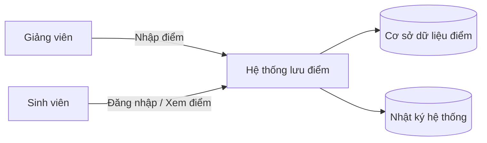

# Context Diagram (Mô tả ngữ cảnh)

## Gợi ý đọc sơ đồ
- **Giảng viên** là tác nhân có quyền nhập điểm.
- **Sinh viên** là tác nhân có quyền xem điểm.
- **Hệ thống lưu điểm** là nơi xử lý đăng nhập, truy vấn và hiển thị dữ liệu.
- **Cơ sở dữ liệu điểm** lưu thông tin cần bảo vệ.
- **Nhật ký hệ thống** hỗ trợ kiểm tra, truy vết sự cố.

1. Assets
Asset 1: Cơ sở dữ liệu điểm (chứa điểm sinh viên)
Asset 2: Tài khoản người dùng (giảng viên, sinh viên)
Asset 3: Nhật ký hệ thống (log truy vết)
2. Mapping CIA
Sự cố A: Sinh viên xem được điểm của người khác → Confidentiality
Sự cố B: Giảng viên bị giả mạo để sửa điểm → Integrity
Sự cố C: Hệ thống không truy cập được khi cần xem điểm → Availability
3. Phân tích sự cố B
Threat: Kẻ tấn công đánh cắp tài khoản giảng viên để chỉnh sửa điểm
Vulnerability:
Xác thực yếu (mật khẩu đơn giản)
Không có 2FA
Không kiểm tra log thường xuyên
Mitigation:
Áp dụng xác thực mạnh (2FA)
Phân quyền rõ ràng (chỉ giảng viên mới được nhập điểm)
Theo dõi log bất thường (nhật ký hệ thống)
Giới hạn số lần đăng nhập sai
4. Reflection

Qua sơ đồ, em hiểu rõ hơn cách các thành phần trong hệ thống tương tác với nhau. Việc phân tích theo mô hình CIA giúp xác định rõ các rủi ro chính như lộ dữ liệu, sửa dữ liệu và gián đoạn hệ thống. Em nhận thấy cơ sở dữ liệu điểm và tài khoản người dùng là các tài sản quan trọng nhất cần bảo vệ. Ngoài ra, nhật ký hệ thống đóng vai trò quan trọng trong việc phát hiện và xử lý sự cố. Nếu không có cơ chế bảo mật phù hợp, hệ thống rất dễ bị tấn công. Vì vậy, cần kết hợp nhiều biện pháp để đảm bảo an toàn.
5. Bonus Flag
FIT-18-01/fit4012-lab0-cia-risk-starter-dhtr286